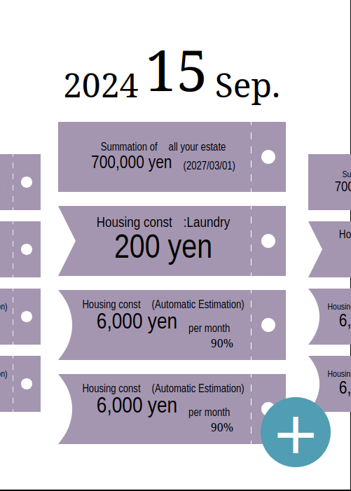

# Miraibo

An application to help users manage their finances, focusing on balancing payments. This app provides features to estimate and visualize the user's financial situation **in the future**. It is particularly useful for young people, such as students.

# Index

- [Miraibo](#miraibo)
- [Index](#index)
- [Specification](#specification)
- [Scheduling Page](#scheduling-page)
  - [Calendar view Screen](#calendar-view-screen)
    - [visual image](#visual-image)
  - [Daily view Screen](#daily-view-screen)
    - [Visual Image](#visual-image-1)
  - [Ticket creation Window](#ticket-creation-window)
- [Ticket Page](#ticket-page)
- [Data Page](#data-page)
- [Utils Page](#utils-page)
- [Ticket](#ticket)
  - [Log Ticket](#log-ticket)
  - [Display Ticket](#display-ticket)
  - [Schedule Ticket](#schedule-ticket)
  - [Estimation Ticket](#estimation-ticket)
- [Category](#category)

# Specification

Miraibo contains three main pages:

- `Scheduling Page`
- `Ticket Page`
- `Data Page`
- `Utils Page`

Each page can be switched using a tab view.

# Scheduling Page

`Scheduling Page` consists of two screens.

- `Calendar view Screen`
- `Daily view Screen`

General flow is like this:

- `Calendar view Screen`
  - Tap date
    - `Daily view Screen`
      - Tap `Ticket creation Button`
        - `Ticket creation Window`
      - Tap `Ticket`
        - `Ticket edit Window` for each type of `Ticket`.

## Calendar view Screen

The `Calendar view Screen` consists of a virtually infinite set of monthly calendar. The calendar shown in the center initially is the one containing today's date. The screen is vertically scrollable.
A monthly calendar consists of year-label, month-label and dates which is arrenged in ordinal way.
`Ticket`s on a date is reflected as a color of the date:

- noTicket(gray): there is no `Ticket` on the date.
- periodicTicket(white/black): there is(are) periodic `Ticket`(s) on the date.
- Ticket(theme): there is(are) `Ticket`(s) on the date.

Each date is button which leads to `Daily view Screen`.

- [What a `Ticket` belonging to a date means?](#ticket)

### visual image

## Daily view Screen

`Daily view Screen` consists of a row of `Tickets Container`, `Label`, and floating `Ticket creation Button`.

`Daily view Screen` is scrollable horizontally.
`Tickets Container` is scrollable vertically.

Tapping the `Ticket creation Button` opens a modal window called the `Ticket creation Window`.

Users can edit the content of a `Ticket` by tapping it. The `Ticket edit Window` is similar to the `Ticket creation Window`, but the `Type selection Tab` is omitted.

Tapping outside the `Tickets Container` returns the screen to the `Calendar View Screen`.

### Visual Image

## Ticket creation Window

The `Ticket creation Window` contains two widgits:

- `Ticket configuration Section`
- `Type selection Tab`

In the `Ticket creation Window`, users can create the following types of tickets:

- `Display Ticket`
- `Schedule Ticket`
- `Estimation Ticket`

The `Type selection Tab` allows users to choose the type of ticket they want to create.

The `Ticket configuration Section` varies based on the type of ticket selected. For details for each type of tickets, check [Ticket](#ticket) section.

There are shered part, `Chips`, too: `Save button`-'Check Mark' and `Delete button`-'Cross Mark' on the top-right.

# Ticket Page

`Ticket Page` contains;

- `Ticket Container`
- `Log Button`

`Ticket Container` is scrollable vertically.
There are `Display Ticket`, `Schedule Ticket` and `Log Ticket` in the container.

`Log Button` is a floating button to register `Receipt Data` into database and to make `Log Ticket`.
`Log Button` lays over `Ticket Container`.

Pressing `Log Button` opens `Log information Window`.
`Log information Window` is like `Ticket creation Window`.
But `Ticket configuration Section` for `Log Ticket` is different from any other type of tickets.

`Log information Window` collects following details:

- Item's (receipt's) category
- Supplementary information
- Registration date
- Amount of money (with notation of in/out)

User can take picture of receipt and attach it.

`Log information Window` also provide `Presets`.

`Presets` will automatically generated from history.
When a `Preset` is selected,

- Item's (receipt's) category
- Supplementary information
- notation of in/out

are automatically filled up. As default, the latest preset is selected.

When `Log Ticket` is pressed, it opens `Ticket edit Window`.
About details for `Ticket edit Window`, check [Log Ticket](#log-ticket) section.

General flow is:

- `Ticket Page`
  - Press `Log Ticket`
    - `Confirmation Dialog`
      - Press `Confirm button`
      - Press `Edit button`
        - `Ticket edit Window`
      - Press `Reject button`
  - Press `Log Button`
    - `Log information Window`

# Data Page

`Data Page` contains:

- `Statistical information Section`
- `Table`
- `Data im/export Button`.

`Data Page` itself is scrollable in any direction.

`Statistical information Section` comes before `Table`, and `Data im/export Button` is a floating button.

`Statistical information Section` show the statistical information:

- Summation of all estate

`Table` shows all of `Receipt Data` in a table format.
Pressing a row, user can open corresponding (log) `Tikcet edit Window`.

Pressing `Data im/export Button` opens `Data im/export Window`.
The window contains:

- `Receipt data export Button`
- `Receipt data import Button`
- `Receipt data override Button`
- `App data backup Button`
- `App data restore Button`

# Utils Page

`Utils Page` contains:

- `Category controller Section`
- `Chart Section`

In `Category controller Section`, categories can be

- renamed
- created
- integrated.

`Category controller Section` provides list of categories and `Category Create Button`.

When a category is pressed, it opens `Category edit Window`.
On `Category edit Window`, users can rename the category by rewriting an inline-text form. And there are pull-down menus that show the list of categories, and an `Integration Button` whose label is 'Integrate with'.

Pressing the `Integration Button` opens a `Confirmation Dialog` which has a `Confirm Button` and a `Cancel Button`.

When the `Category Create Button` is pressed, the `Category Create Window` opens.
The `Category Create Window` merely contains an inline-text form for its name, a `Create Button`, and a `Cancel Button`.

In the `Chart Section`, users can generate accumulation charts that indicate the increase and decrease of the gross estate for specific categories or all categories over time.
Users are also able to generate subtotal charts which show the total amounts per month.

# Ticket

`Ticket` appears in Scheduling Page and Ticket Page.

`Ticket`s are classified into four types:

- Log Ticket
- Display Ticket
- Schedule Ticket
- Estimation Ticket

A `Ticket` is a standardized interface to present/edit information.

A `Ticket` belongs to some days. That means, it appears on the corresponding date on the `Scheduling Page`.

On `Scheduling Page/Ticket Container`, `Display Ticket` appears at first.
Then `Schedule Ticket`, `Estimation Ticket` and `Log Ticket` follow in order.

On `Ticket Page/Ticket Container`, `Display Ticket` appears at first.
Then `Schedule Ticket` and `Log Ticket` follow in order.

## Log Ticket

A Log Ticket allows users to confirm and edit logged `Receipt Data`. A Log Ticket contains the following details:

- Item's (receipt's) category
- Supplementary information
- Registration date
- Amount of money (with notation of in/out)
- URL of the registered image (if any)
  - normally hidden and only visible in `Ticket edit Window`
  - updatable in `Ticket edit Window`

When pressed in `Ticket Page`, `Confirmation Dialog` opens.
`Confirmation Dialog` has `Confirm button`, `Edit button`.
It automatically disappers from `Ticket Page` in some days.

When `Confirm button` is pressed, the ticket disappears from the `Ticket Page`.
When edit button is pressed, the `Ticket edit Window` opens, allowing users to edit the information above.

When pressed in `Scheduling Page`, it opens `Ticket edit Widnow`.

This ticket belongs to `Registration date`.

Note that, single ticket only belongs to single category.

## Display Ticket

A Display Ticket allows users to check the situation.

Display Ticket has 3 Term Modes:

- Until today
- Last designated period
- Until a designated date

For each term-mode, there are some options.

On `Until today`:
On `Last designated period`:

- daily average
- daily quartile average
- monthly average
- monthly quartile average
- summation

On `Until a designated date`:

- summation

For all modes and options, `Target categories` should be specified.
User can choose multiple categories and 'all' option.

Both on the `Scheduling Page` and on the `Ticket Page`, it opens `Ticket edit Window` when it is pressed.

On `Until today` and `Last designated period`:

Display Ticket belongs to all days, that means, the Ticket appears in all days of `Ticket Container`.

On `Until a designated date`:

Display Ticket belongs to all days until the date, that means, the Ticket only appears until the date.

For `Last designated period`, there are period-options:

- week
- month
- half-year
- year

## Schedule Ticket

`Schedule Ticket` basically exists for estimation. But it also omit the users' labor to register ticket by their own.

On `Scheduling Page`, `Schedule Ticket` appears on the date to which it belongs.
When it pressed, `Ticket edit Window` opens.

On `Ticket Page`, its function is just like `Log Ticket`.
It automatically appears on the registered date.
When pressed, it oepns `Confirmation Dialog` which has `Confirm button`,  `Edit button` and `Reject button`. When it's confirmed, it pop `Log Ticket` and disappears.
Pressing `Edit button`, of course, opens `Ticket edit Window`.
Pressing `Reject button` removes the ticket. However, it does not remove schedule itself, that means, if it is repeatitive schedule, it does not delete the schedule.

On `Scheduling Page`, it opens `Ticket edit Window` when pressed.

`Ticket edit Window` collects:

- `Category`
  - single choice
- Supplement
  - Free text (nullable)
- Amount
  - user can select income or outcome
  - does not support nagative input
- RepeatSetting
  - no
  - yes
    - frequency
      - interval: e.g. every xxx day
      - week: e.g. every Monday and every Sunday
      - month: e.g. 5th day (from begining), 3th day (from end)
      - year: annual event
    - period
      - from: the date when the period begins or unlimited
      - until: the date when the period ends or unlimited

## Estimation Ticket

Estimation Ticket exists for estimation. This ticket only appears on `Scheduling Page`.

When it's pressed in the `Scheduling Page/Ticket Container`, it opens `Ticket edit Window`.

For this ticket,

- `Category`
  - single choice
- period
  - from: the date when the period begins or unlimited
  - until: the date when the period ends or unlimited
- display_mode
  - perDay
  - perWeek
  - perMonth
  - perYear

should be specified.

it belongs to all days of designated period.

# Category

Each `Receipt Data` should have **a single** `Category`.

`Category` is like:

- Food
- Gas
- Water
- Electricity
- Transportation
- EducationFee
- EducationMaterials
- Amusument
- Furniture
- Necessities
- OtherExpense
- Scholarship
- Payment
- Ajustment
